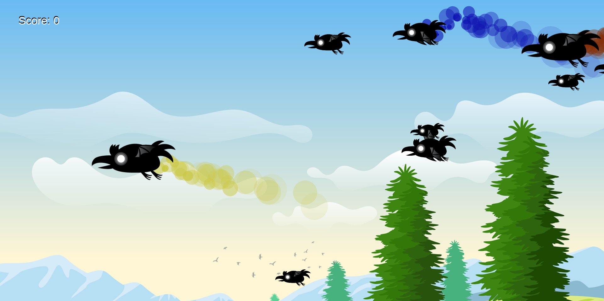

# Raven Shooter Game Guide

Welcome to the Raven Shooter Game, where your reflexes and aiming skills will be tested as you try to hit as many ravens as possible before they fly across the screen. Prepare yourself for a challenging game experience with dynamically sized ravens and stunning tail animations. Here's everything you need to know to get started!

## How to Play

### Starting the Game

- **Launch the Game**: Open the game application on your device.
- **Begin Play**: Click the 'Start' button on the main menu to begin your game.

### Game Objective

The objective of the game is to shoot as many ravens as possible before any raven escapes off the opposite side of the screen. Each raven shot increases your score by one point.

### Controls

- **Aim**: Move your mouse or finger on the touchscreen to aim at the ravens.
- **Shoot**: Click with your mouse or tap on the screen to shoot at the targeted raven.

## Features

### Dynamic Raven Sizes

- Ravens appear in various sizes which might affect their speed and the difficulty level of hitting them.

### Animated Raven Tails

- Some ravens have animated tails which add visual flair and challenge as they move across the screen.

## Scoring

- You earn **1 point** for each raven you shoot.
- Try to achieve a high score before a raven escapes the screen, which will end the game.

## Game Over

- The game ends when a raven successfully crosses to the other side of the screen without being shot.
- Your final score will be displayed, and you can choose to play again or exit the game.

## Tips

- Keep an eye on varying raven sizes; smaller ravens are quicker and more challenging to hit.
- Watch for the tail animations to predict their flight path.
- Practice to improve your aiming speed and accuracy.

## Have Fun!

We hope you enjoy playing the Raven Shooter Game. Challenge yourself to beat your high score and climb the leaderboards. Happy shooting!

